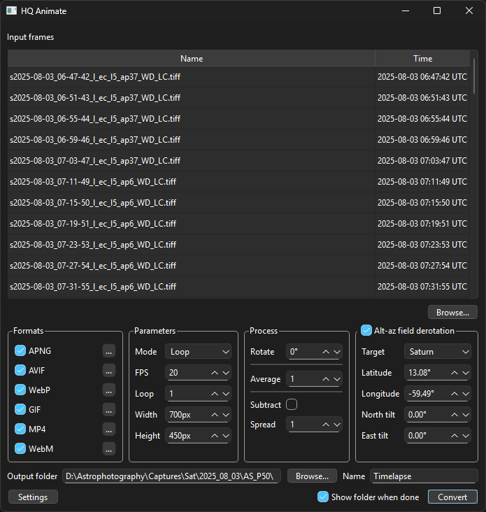

# HQ Animate
Create high quality animations from a sequence of image files.



## Installation

Requires Python 3.12 or later.

### Install with `pipx`
`pipx` is recommended since it installs Python applications into isolated environments.

Installation instructions for `pipx`: [https://pipx.pypa.io/stable/installation/](https://pipx.pypa.io/stable/installation/)

Open a terminal and navigate to the project's root folder, where `pyproject.toml` is located, then run:
```
pipx install https://github.com/EthanChappel/HQ-Animate/archive/refs/heads/main.tar.gz
```

#### Upgrade

To upgrade the program to the latest version, run:

```
pipx upgrade hq-animate
```

### Install with `pip`
Alternatively, install into the current Python environemt with `pip`.

Open a terminal and navigate to the project's root folder, where pyproject.toml is located, then run:

```
pip install https://github.com/EthanChappel/HQ-Animate/archive/refs/heads/main.tar.gz
```

#### Upgrade

To upgrade the program to the latest version, run:

```
pip install --upgrade hq-animate
```

## Usage

To start the program, call it from a terminal:

```
hq-animate
```
